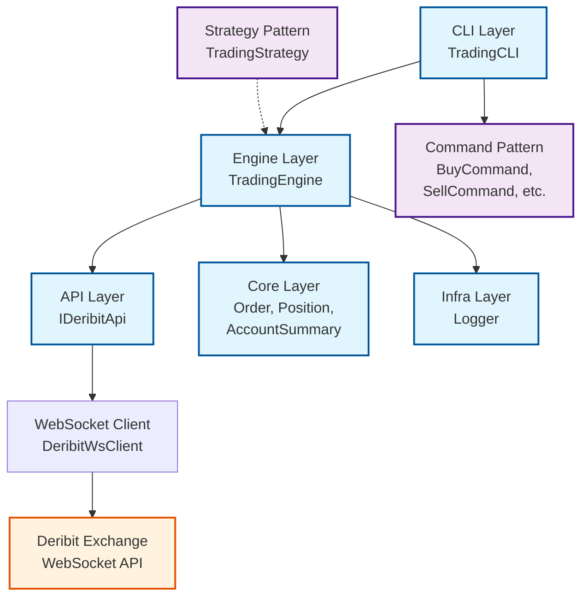
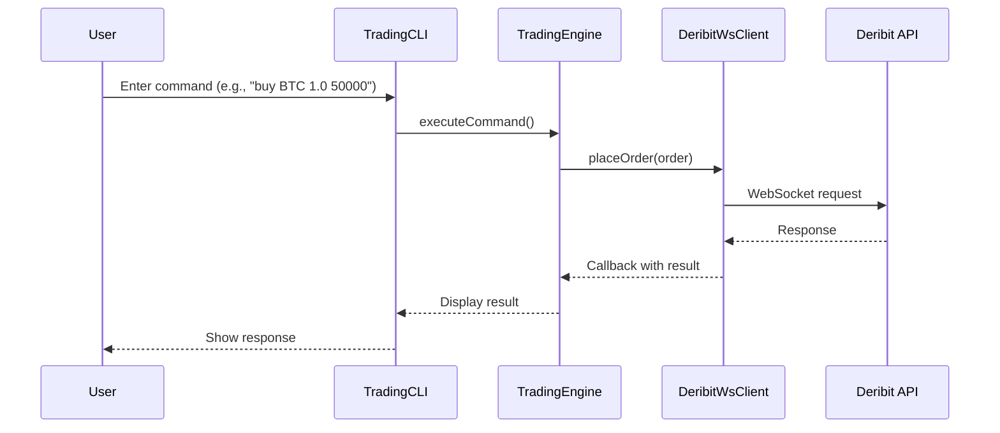

# Deribit Trading System

[](https://isocpp.org/)
[](https://cmake.org/)
[](LICENSE)

A comprehensive C++ trading system for the Deribit cryptocurrency exchange. This project demonstrates proper software architecture with separation of concerns, design patterns, and modular design. Built for educational purposes to showcase modern C++ development practices and trading system architecture.

> **⚠️ Disclaimer**: This software is for educational and research purposes only. Cryptocurrency trading involves significant risk of loss. Use at your own risk and never trade with money you cannot afford to lose. Always test on testnet first.

## Table of Contents

- [Features](#features)
- [Architecture](#architecture)
- [Prerequisites](#prerequisites)
- [Installation](#installation)
- [Building](#building)
- [Usage](#usage)
- [Design Patterns](#design-patterns-used)
- [Contributing](#contributing)
- [License](#license)

## Features

- **🔗 Connection Management**: Connect to Deribit testnet or mainnet via WebSocket
- **🔐 Authentication**: Secure API authentication using client credentials
- **📊 Public API Access**:
  - Get server time
  - Retrieve available instruments and currencies
  - Fetch order books and trading view chart data
- **💼 Private API Access**:
  - Get account summary and positions
  - Place, modify, and cancel orders
  - Retrieve open orders and order history
- **📡 Real-time Subscriptions**:
  - Subscribe to order book updates
  - Trade streams
  - Ticker updates
- **💻 Command-Line Interface**: User-friendly CLI for managing trading and market data interactions
- **🏗️ Modular Architecture**: Uses design patterns like Strategy, Command, Observer, and Dependency Injection

## Architecture

```
deribit-trading-system/
├── api/           # WebSocket client implementation with interface segregation
├── core/          # Domain models (Order, Position, AccountSummary)
├── engine/        # Trading logic and strategy management
├── cli/           # Command pattern for user interactions
├── infra/         # Logging and infrastructure utilities
└── src/           # Main application entry point
```

- **API Layer** (`api/`): WebSocket client implementation with interface segregation
- **Core** (`core/`): Domain models (Order, Position, AccountSummary, etc.)
- **Engine** (`engine/`): Trading logic, strategy management, and API orchestration
- **CLI** (`cli/`): Command pattern implementation for user interactions
- **Infra** (`infra/`): Cross-cutting concerns like logging

## Prerequisites

- **C++ Compiler**: GCC 7+ / Clang 5+ / MSVC 2017+ with C++17 support
- **CMake**: Version 3.10 or higher
- **Git**: For cloning dependencies

### Dependencies

- **Boost** (system, thread) - Version 1.65+
- **WebSocket++** - WebSocket library for C++
- **nlohmann/json** - JSON library for modern C++
- **OpenSSL** - For secure WebSocket connections

## Installation

### Ubuntu/Debian

```bash
# Update package list
sudo apt update

# Install required packages
sudo apt install -y build-essential cmake libboost-all-dev libssl-dev nlohmann-json3-dev git

# Install websocketpp (if not available via package manager)
git clone https://github.com/zaphoyd/websocketpp.git
cd websocketpp
mkdir build && cd build
cmake ..
sudo make install
cd ../..
```

### macOS (using Homebrew)

```bash
# Install dependencies
brew install cmake boost openssl nlohmann-json git

# Install websocketpp
git clone https://github.com/zaphoyd/websocketpp.git
cd websocketpp
mkdir build && cd build
cmake ..
make install
cd ../..
```

### Windows (using vcpkg)

```powershell
# Install vcpkg if not already installed
git clone https://github.com/Microsoft/vcpkg.git
cd vcpkg
.\bootstrap-vcpkg.bat
.\vcpkg integrate install

# Install dependencies
.\vcpkg install boost websocketpp nlohmann-json openssl
```

## Building

1. **Clone the repository**:
   ```bash
   git clone https://github.com/yourusername/deribit-trading-system.git
   cd deribit-trading-system
   ```

2. **Create build directory**:
   ```bash
   mkdir build && cd build
   ```

3. **Configure with CMake**:
   ```bash
   cmake ..
   # On Windows with vcpkg, use: cmake .. -DCMAKE_TOOLCHAIN_FILE=C:/path/to/vcpkg/scripts/buildsystems/vcpkg.cmake
   ```

4. **Build the project**:
   ```bash
   make  # or cmake --build . on Windows
   ```

5. **Run tests** (if implemented):
   ```bash
   ctest
   ```

## Usage

### Quick Start

1. **Run the executable**:
   ```bash
   ./deribit  # or deribit.exe on Windows
   ```

2. **Choose environment**:
   ```
   Connect to testnet? (y/n): y
   ```

3. **Enter credentials**:
   ```
   Enter client_id: your_client_id
   Enter client_secret: your_client_secret
   ```

4. **Start trading**:
   ```
   Deribit> help
   ```

### CLI Commands

| Command | Description | Example |
|---------|-------------|---------|
| `help` | Show available commands | `help` |
| `quit` | Exit the program | `quit` |
| `buy <instrument> <amount> [price\|market]` | Place buy order | `buy BTC-PERPETUAL 1.0 50000` |
| `sell <instrument> <amount> [price\|market]` | Place sell order | `sell BTC-PERPETUAL 1.0 market` |
| `book <instrument>` | Get orderbook | `book BTC-PERPETUAL` |
| `sub <type> <instrument>` | Subscribe to updates | `sub book BTC-PERPETUAL` |

### API Credentials

To use this system, you need Deribit API credentials:

1. Create a Deribit account at [deribit.com](https://www.deribit.com)
2. Generate API keys in your account settings
3. Use testnet for development: [test.deribit.com](https://test.deribit.com)

## Design Patterns Used

This project demonstrates several software design patterns:

- **🎯 Strategy Pattern**: For implementing different trading strategies
- **📋 Command Pattern**: For CLI command handling and undo/redo capabilities
- **👁️ Observer Pattern**: For subscription callbacks and event handling
- **💉 Dependency Injection**: Engine depends on API interface for testability
- **🔌 Interface Segregation**: Separate API interfaces for different concerns
- **🏭 Factory Pattern**: Command creation and registration system

## Contributing

Contributions are welcome! Please follow these steps:

1. Fork the repository
2. Create a feature branch (`git checkout -b feature/amazing-feature`)
3. Commit your changes (`git commit -m 'Add amazing feature'`)
4. Push to the branch (`git push origin feature/amazing-feature`)
5. Open a Pull Request

### Development Guidelines

- Follow C++17 standards
- Use meaningful variable and function names
- Add comments for complex logic
- Write tests for new features
- Update documentation as needed

## License

This project is licensed under the MIT License - see the [LICENSE](LICENSE) file for details.

## Acknowledgments

- [Deribit](https://www.deribit.com) for their excellent API documentation
- [WebSocket++](https://github.com/zaphoyd/websocketpp) for the WebSocket library
- [nlohmann/json](https://github.com/nlohmann/json) for the JSON library

---

## Architecture Overview



### Data Flow



### Component Responsibilities

| Component | Responsibility | Key Classes |
|-----------|----------------|-------------|
| **CLI** | User interaction, command parsing | `TradingCLI`, `Command`, `BuyCommand` |
| **Engine** | Business logic, orchestration | `TradingEngine`, `TradingStrategy` |
| **API** | External communication | `IDeribitApi`, `DeribitWsClient` |
| **Core** | Domain models | `Order`, `Position`, `AccountSummary` |
| **Infra** | Cross-cutting concerns | `Logger` |

---

**Note**: This is an educational project. For production trading systems, consider using established libraries and frameworks with proper security audits.