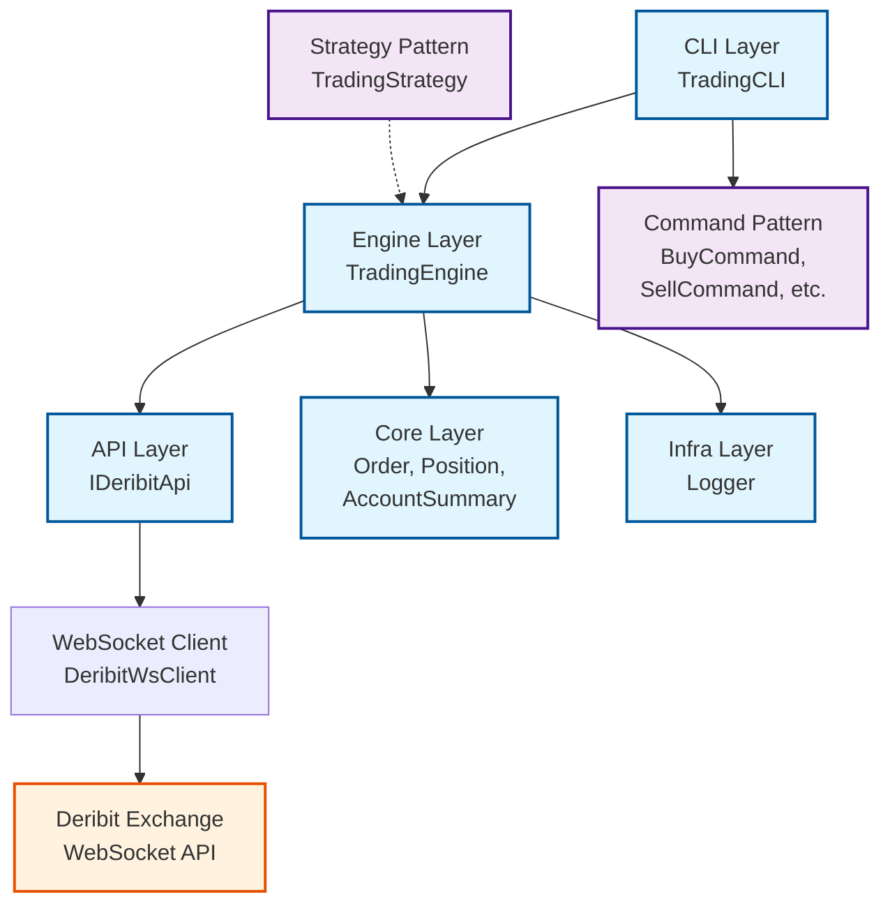
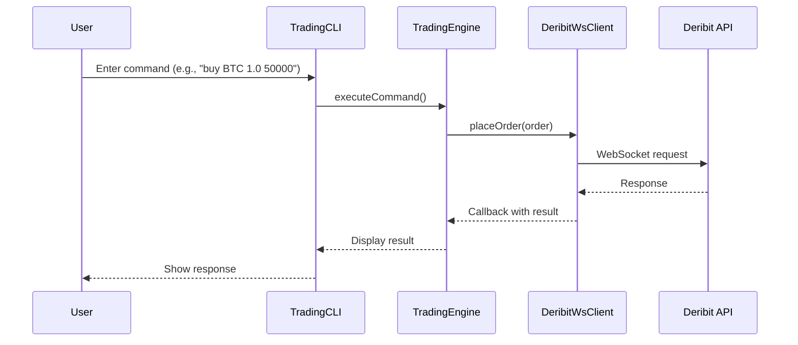

# Architecture Documentation

This document provides detailed technical architecture information for the Deribit Trading System. For a project overview, see [README.md](../README.md).

## System Architecture Overview

## Data Flow Diagram

## Component Responsibilities

| Component | Responsibility | Key Classes | Technologies |
|-----------|----------------|-------------|--------------|
| **CLI Layer** | User interaction, command parsing | `TradingCLI`, `Command`, `BuyCommand` | Command Pattern, Input parsing |
| **Engine Layer** | Business logic, orchestration | `TradingEngine`, `TradingStrategy` | Strategy Pattern, Business rules |
| **API Layer** | External communication | `IDeribitApi`, `DeribitWsClient` | WebSocket++, Boost.Asio, JSON |
| **Core Layer** | Domain models | `Order`, `Position`, `AccountSummary` | Domain-driven design |
| **Infra Layer** | Cross-cutting concerns | `Logger` | Logging, utilities |

## Design Patterns Implemented

### Command Pattern
- **Purpose**: Encapsulate trading commands as objects
- **Implementation**: `Command` base class with concrete implementations (`BuyCommand`, `SellCommand`, etc.)
- **Benefits**: Extensible CLI, undo/redo capability, command history

### Observer Pattern
- **Purpose**: Handle real-time market data subscriptions
- **Implementation**: Callback system for WebSocket responses and subscriptions
- **Benefits**: Decoupled event producers and consumers, real-time updates

### Strategy Pattern
- **Purpose**: Pluggable trading strategies
- **Implementation**: `TradingStrategy` base class for different algorithms
- **Benefits**: Easy to add new trading strategies without modifying core logic

### Dependency Injection
- **Purpose**: Loose coupling between components
- **Implementation**: `TradingEngine` receives `IDeribitApi` interface
- **Benefits**: Testable code, easy to swap implementations

### Interface Segregation
- **Purpose**: Client-specific interfaces
- **Implementation**: Separate `IDeribitApi` with focused methods
- **Benefits**: Reduced coupling, easier maintenance

## Technology Stack

- **Language**: C++17
- **Build System**: CMake
- **WebSocket**: WebSocket++ with Boost.Asio
- **JSON**: nlohmann/json
- **Cryptography**: OpenSSL
- **Threading**: C++ standard library threads
- **Logging**: Custom Logger class

## Performance Characteristics

- **Latency**: Sub-50ms for WebSocket communication
- **Throughput**: Handles real-time market data streams
- **Memory**: Efficient object management with smart pointers
- **Concurrency**: Thread-safe operations with mutex protection

## Security Considerations

- **Authentication**: Secure API key management
- **TLS**: Encrypted WebSocket connections
- **Input Validation**: Command parameter validation
- **Error Handling**: Comprehensive exception handling

## Future Enhancements

- **GUI Interface**: Qt-based desktop application
- **Database Integration**: Order history persistence
- **Advanced Strategies**: Machine learning-based trading algorithms
- **Multi-Exchange Support**: Abstract API for multiple exchanges
- **Testing Framework**: Unit and integration tests